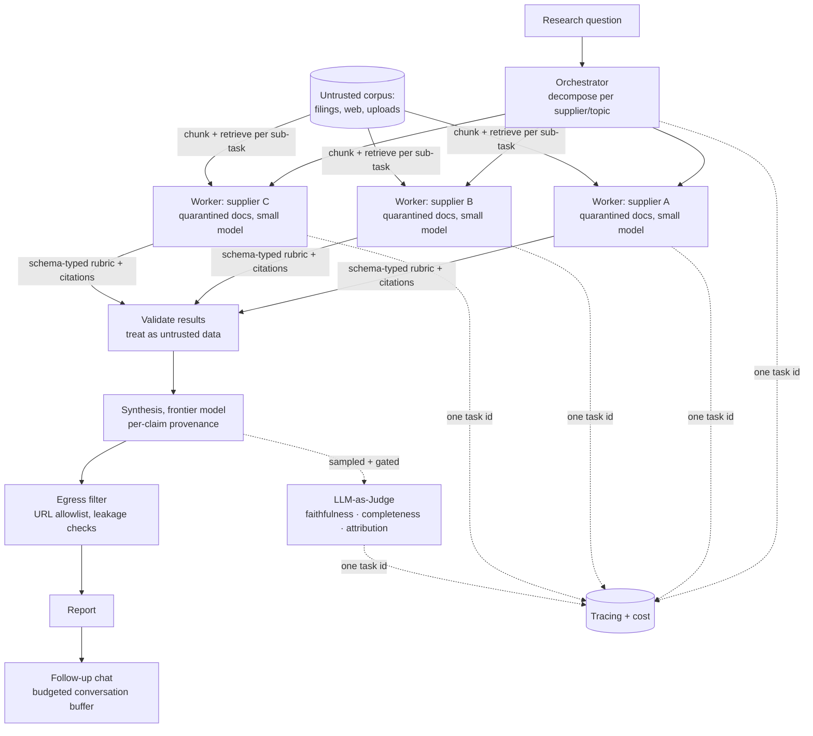

# Example — Deep Research Service

> A B2B intelligence platform wants a "deep research" feature: given a question like
> *"How exposed are our three logistics suppliers to the new EU battery regulation?"*,
> produce a sourced, reviewable report in minutes — from dozens of documents the
> company never wrote and cannot trust.

## Project overview

The platform aggregates filings, news, regulatory texts, and customer-uploaded vendor
documents. Analysts currently spend days per question. The feature must read widely
(30–100 documents per question), reason per entity, and produce a report with claims
traceable to sources — conversationally refinable afterward ("now weight supplier B's
lithium sourcing higher").

## Business problem

Analyst time is the bottleneck and the margin. A report that hallucinates one number is
worse than no report — customers make purchasing and compliance decisions from it. The
input corpus is adversarial by nature: it includes documents *written by the companies
being analyzed* and pages scraped from the open web.

## Requirements

- Multi-document, multi-entity research with per-claim **source attribution**.
- Quality that is **measured**, not vibes — regressions caught before customers see them.
- Follow-up dialogue on a finished report (session-scoped, hours long).
- A poisoned source document must not be able to steer the report or exfiltrate data.
- Minutes-scale latency is acceptable; unbounded cost is not.

## Constraints

- Documents are third-party content — untrusted by definition.
- Reports are high-stakes: every claim needs a human-auditable trail.
- The team is small; every moving part needs a reason to exist.

## Architectural decisions

| Decision | Choice | Why |
|----------|--------|-----|
| Scale reading beyond one context | [**Orchestrator–Worker**](../../patterns/agents/orchestrator-worker/) | One agent drowns at ~30 documents; per-supplier workers with schema-typed results keep synthesis clean, parallel, and per-worker budgeted |
| Contain hostile documents | [**Prompt Injection Defense**](../../patterns/security/prompt-injection-defense/) | Every document is quarantined per worker; a poisoned filing corrupts at most one worker's rubric, and egress checks catch exfiltration links in the report |
| Measure report quality | [**LLM-as-Judge**](../../patterns/evaluation/llm-as-judge/) | Faithfulness/completeness/attribution rubric, calibrated on analyst-labeled reports; gates every prompt or model change in CI |
| Follow-up dialogue | [**Conversation (Buffer) Memory**](../../patterns/memory/conversation-memory/) | The report conversation is hours, not weeks: a budgeted buffer with atomic tool-pair eviction covers it without a memory store |
| Right-size the models | **Model Cascade** (cheap-first) | Extraction workers run a small model; only synthesis and judging use the frontier model |
| Keep it operable | **Tracing** + **Token & Cost Tracking** | One task id spans orchestrator, workers, and judge; the 3–15× fan-out cost is a dashboard number |

## Selected MAP patterns

- [Orchestrator–Worker](../../patterns/agents/orchestrator-worker/) *(published)* — decompose per supplier/topic; validate structured worker results; synthesize with provenance.
- [Prompt Injection Defense](../../patterns/security/prompt-injection-defense/) *(published)* — quarantine + marking inside each worker; egress filtering on the final report.
- [LLM-as-Judge](../../patterns/evaluation/llm-as-judge/) *(published)* — anchored rubric, calibration set from analyst labels, per-criterion regression gates.
- [Conversation (Buffer) Memory](../../patterns/memory/conversation-memory/) *(published)* — the follow-up session's recency layer.
- [Chunking](../../patterns/retrieval/chunking/) *(published)* — documents are chunked per worker for retrieval within each sub-task.
- **Model Cascade**, **Tracing**, **Token & Cost Tracking** — see [Performance](../../patterns/performance/) and [Observability](../../patterns/observability/).

## Rejected alternatives

- **One long-context agent reading everything.** Rejected: at 100 documents even a
  large window is mostly noise; quality decays (lost-in-the-middle), one injected
  document contaminates the only context, and a retry costs the whole run.
- **Fully autonomous multi-agent swarm.** Rejected: peer agents negotiating with each
  other are undebuggable for a small team; a strict orchestrator hierarchy with
  schema-typed results is auditable and testable.
- **Human review of every report instead of judges.** Rejected as the *only* control:
  it reintroduces the analyst bottleneck. Humans review judge-flagged and sampled
  reports; the judge amplifies their labels across every run.
- **Skipping injection defense because "the model is careful".** Rejected: the corpus
  contains documents authored by analyzed companies — the incentive to inject is
  structural, not hypothetical.
- **Long-term memory for follow-up chat.** Deferred: sessions are hours-long and
  report-scoped; a budgeted buffer covers them. Revisit if analysts demand
  cross-report memory (the eviction logs will show what's being lost).

## Architecture

## Trade-offs to watch

- **Fan-out cost is the product's unit economics.** Per-worker budgets and the cascade
  keep the 3–15× multiplier bounded; the cost dashboard is a launch requirement, not
  an afterthought.
- **Schema-typed worker results are lossy.** If analysts keep asking "why did the
  worker conclude X", widen the schema (include evidence quotes) before considering
  raw-transcript sharing — the boundary is also the injection containment.
- **The judge is a model too.** Its calibration set must grow from analyst
  disagreements, and its version is pinned per release; an uncalibrated judge would
  gate ships on noise.
- **Buffer eviction on hours-long sessions.** Watch the eviction logs: if follow-up
  chats routinely lose load-bearing constraints, that's the documented trigger for a
  summary-memory layer — with data on exactly what was lost.
