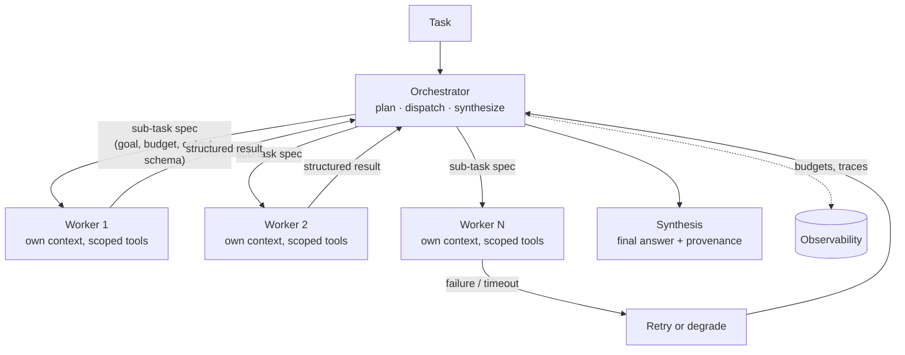

# Orchestrator–Worker

> One privileged agent owns the task: it decomposes the goal, dispatches bounded
> sub-tasks to worker agents with clean, isolated contexts, and synthesizes their
> results — so complexity scales by adding workers, not by growing one context window.

**Category:** Agents
**Also known as:** Coordinator–delegate, Lead agent + subagents, Fan-out/fan-in agents
**Maturity:** Emerging

---

## Decision

**Use Orchestrator–Worker if:**

- ✅ the task decomposes into sub-tasks that don't need each other's intermediate state (research N sources, review M files, process K documents)
- ✅ a single agent's context fills up with intermediate noise before the task completes
- ✅ sub-tasks benefit from *different* configurations — models, tools, prompts, or permissions per worker

**Avoid (or defer) Orchestrator–Worker if:**

- ❌ one agent with good tools finishes the task reliably — a second agent is pure overhead until proven otherwise
- ❌ sub-tasks are tightly coupled (each step needs the previous step's reasoning, not just its result)
- ❌ you can't yet evaluate single-agent quality — you won't be able to tell whether orchestration helped or just multiplied cost

## MAP Score

| Dimension | Score | |
|---|---|---|
| Complexity | ★★★★☆ | 4/5 |
| Latency | ★★☆☆☆ | 2/5 |
| Cost | ★★☆☆☆ | 2/5 |
| Accuracy Impact | ★★★★☆ | 4/5 |
| Production Readiness | ★★★☆☆ | 3/5 |

<sub>Higher is better, except **Complexity** (lower is simpler). See [MAP Score](../../../docs/specs/map-score.md).</sub>

## Problem

A single agent carries every piece of a task in one context window: the plan, every tool
result, every dead end, every draft. On long tasks that window becomes the bottleneck —
retrieval dumps and diffs crowd out the instructions, the agent starts forgetting its own
plan, and quality degrades in a way no prompt tweak fixes. Meanwhile the task itself is
often *embarrassingly parallel*: reviewing twelve files, comparing eight vendors,
checking a claim against five sources. A single agent does those serially, paying full
latency for work that has no ordering constraint, and one poisoned or failed sub-task
contaminates the only context there is.

## Motivation

A due-diligence assistant must answer: *"Compare the security posture of these six
vendors against our checklist."* As one agent, it reads vendor one's documents, then
vendor two's — and by vendor four, the context holds hundreds of thousands of tokens of
raw SOC 2 excerpts. The comparison at the end is written by a model whose window is
mostly noise, anchored on whichever vendor it read most recently.

Restructured: an orchestrator turns the checklist into six identical sub-tasks —
*"assess vendor X against this checklist; return the filled rubric, citations, and open
questions"*. Six workers run in parallel, each seeing only its own vendor's documents.
The orchestrator receives six one-page rubrics — not six document dumps — and writes the
comparison from clean, comparable inputs. Latency drops to roughly one worker's runtime
plus synthesis; a worker that fails or gets prompt-injected damages one rubric, not the
whole analysis.

## When to use

- **Fan-out research and analysis** — many sources, files, or entities that can be
  processed independently and merged at the end.
- **Context isolation as a feature** — each worker starts clean, so bulky intermediate
  material (retrieved docs, logs, diffs) never accumulates in one window; only distilled
  results flow up ([Context Window Budgeting](../../context/)).
- **Heterogeneous sub-tasks** — a cheap model for extraction workers, a strong model for
  the synthesis; different tools and permissions per worker (a read-only "researcher"
  vs. a write-capable "editor").
- **Failure containment** — a worker that times out, hallucinates, or ingests hostile
  content is a bounded, retryable unit ([Prompt Injection Defense](../../security/prompt-injection-defense/)).

## When NOT to use

- **A single capable agent suffices.** Most tasks that look multi-agent are single-agent
  tasks with a missing tool. Exhaust the simple option first; add orchestration when the
  measured failure is context exhaustion or serial latency, not vibes.
- **Sequential, tightly-coupled reasoning.** If step *n+1* needs step *n*'s chain of
  thought — debugging, proofs, iterative design — splitting it across agents severs the
  reasoning and adds a lossy summarization boundary at every hop.
- **Chat-latency budgets.** Decompose → dispatch → synthesize is a batch/agentic shape;
  an interactive product that needs first tokens in a second wants one agent
  [streaming](../../performance/).
- **Before you have evals.** Orchestration multiplies tokens 3–15×; without an
  evaluation harness you cannot prove that bought anything
  ([Golden Dataset](../../evaluation/), [LLM-as-Judge](../../evaluation/llm-as-judge/)).

## Architecture Diagram



## Flow

1. **Decompose.** The orchestrator turns the goal into explicit sub-task specs: the
   objective, the inputs, the tool scope, a token/step budget, and — critically — the
   **output schema** the worker must return. Vague sub-tasks ("look into vendor X")
   produce unmergeable results.
2. **Dispatch.** Independent sub-tasks run in parallel, each worker in a fresh context
   with only its spec and scoped tools. Workers never see the orchestrator's system
   prompt, other workers' contexts, or credentials beyond their scope.
3. **Bound.** Every worker carries a budget (tokens, tool calls, wall clock) and a
   [tool budget](../)-style stop rule. A worker that exhausts its budget returns a
   partial result with a status, not an exception that unwinds the task.
4. **Collect and validate.** The orchestrator validates each result against the output
   schema, treats worker output as *untrusted input* (it may embed hostile retrieved
   content), and decides per sub-task: accept, retry with a refined spec, or degrade
   (proceed without it, flagged).
5. **Synthesize.** A final pass — often the strongest model in the system — merges
   validated results into the answer, citing which worker/source produced what.
6. **Trace everything.** One task id spans orchestrator and workers; per-worker token
   counts, budgets hit, retries, and latency feed [Tracing](../../observability/) and
   cost tracking — this is the pattern's main operational cost driver.

## Trade-offs

The central tension is **capability vs. coherence**: workers give you parallelism,
isolation, and per-task tuning, but every orchestrator↔worker boundary is a lossy,
schema-shaped communication channel that can drop the nuance a single context would
have kept.

| Dimension | Single agent | Orchestrator–Worker |
|-----------|--------------|---------------------|
| Context pressure | Everything in one window | Only distilled results reach the top |
| Latency (parallelizable work) | Serial | ~max(worker) + synthesis |
| Token cost | 1× | Commonly 3–15× |
| Failure blast radius | Whole task | One sub-task (retryable) |
| Reasoning continuity | Full chain kept | Cut at every boundary |
| Debuggability | One transcript | N+1 transcripts, needs real tracing |

### Advantages

- Scales *scope* without scaling one context window; quality stops degrading with task
  size at the point decomposition holds.
- Parallel fan-out collapses latency on independent work.
- Per-worker model/tool/permission choice: cheap models where they suffice, strong
  models where it counts, least privilege everywhere.
- Failures and injections are contained to a worker and its one result.

### Disadvantages

- Token cost multiplies; synthesis reads everything the workers distilled.
- The decomposition is now *your* code's responsibility; a bad split produces confident
  garbage merged from irrelevant sub-answers.
- Lossy boundaries: workers can't share discoveries mid-flight without extra machinery
  (blackboards, shared memory) that reintroduces coupling.
- Operationally heavier: budgets, retries, schema validation, and multi-transcript
  tracing are table stakes, not extras.

## Failure Modes & Anti-patterns

- ❌ **Multi-agent by default** — reaching for orchestration because it's exciting,
  not because a single agent measurably fails. The single agent is the baseline to beat.
- ❌ **Vague sub-task specs** — workers without an output schema return prose the
  orchestrator can't merge; synthesis degenerates into "summarize these summaries".
- ❌ **Unbounded workers** — no token/step/time budget means one looping worker holds
  the whole task hostage and dominates cost.
- ❌ **Trusting worker output** — workers read untrusted content; their results can
  carry injected instructions upward. Validate schema, sanitize, never execute.
- ❌ **Telephone-game depth** — workers spawning workers spawning workers; each level
  adds a summarization loss. Two levels is almost always the ceiling worth paying for.
- ❌ **Shared mutable context** — letting workers write into one another's windows to
  "collaborate" recreates the original problem plus race conditions.

## Reference Implementation

Minimal, dependency-free skeleton of the control plane: sub-task specs with budgets and
schemas, parallel dispatch, validation, and degrade-on-failure. The `call_worker`
function is your agent runtime (one LLM+tools loop per spec).

```python
import concurrent.futures as cf
from dataclasses import dataclass, field

@dataclass
class SubTask:
    goal: str                      # one bounded objective, not a theme
    inputs: dict                   # everything the worker may see
    output_schema: dict            # what it must return (validated below)
    max_tokens: int = 20_000       # budget: tokens
    max_tool_calls: int = 15       # budget: actions
    timeout_s: int = 120           # budget: wall clock

@dataclass
class WorkerResult:
    task: SubTask
    status: str                    # ok | partial | failed
    data: dict = field(default_factory=dict)

def validate(result: WorkerResult) -> bool:
    """Schema check + treat worker output as untrusted data (never as instructions)."""
    return result.status in ("ok", "partial") and all(
        key in result.data for key in result.task.output_schema
    )

def orchestrate(subtasks: list[SubTask], call_worker) -> dict:
    """Fan out, collect, degrade on failure; synthesis sees only validated results."""
    results: list[WorkerResult] = []
    with cf.ThreadPoolExecutor(max_workers=8) as pool:
        futures = {pool.submit(call_worker, task): task for task in subtasks}
        for future in cf.as_completed(futures):
            task = futures[future]
            try:
                result = future.result(timeout=task.timeout_s)
            except Exception as error:
                result = WorkerResult(task, "failed", {"error": str(error)})
            results.append(result)

    accepted = [r for r in results if validate(r)]
    degraded = [r for r in results if not validate(r)]
    return {                        # input to the synthesis call, with provenance
        "accepted": [{"goal": r.task.goal, **r.data} for r in accepted],
        "degraded": [{"goal": r.task.goal, "status": r.status} for r in degraded],
    }
```

## Production Variants

- **Supervisor / router front-end** — a routing agent classifies the request and only
  invokes orchestration for tasks that need it; simple requests go to a single agent
  ([Supervisor / Router Agent](../)).
- **Plan-first orchestration** — decomposition as an explicit, inspectable (sometimes
  human-approved) plan artifact before any worker runs
  ([Plan-and-Execute](../), [Human-in-the-Loop Approval](../)).
- **Heterogeneous fleets** — cheap fast models for extraction workers, a frontier model
  for synthesis; per-worker tool allowlists as the permission boundary.
- **Blackboard coordination** — workers read/write a shared, structured store instead
  of returning once; buys mid-flight collaboration at the price of coupling
  ([Blackboard](../)).
- **Durable execution** — orchestrator state checkpointed (workflow engines) so a
  crashed run resumes at the last completed sub-task instead of re-paying the fan-out.

## Related Patterns

- [Planner](../) / [Plan-and-Execute](../) — the decomposition half, as its own pattern.
- [Supervisor / Router Agent](../) — routing *between* agents rather than decomposing one task.
- [Multi-Agent Collaboration](../) — peer agents negotiating, vs. this pattern's strict hierarchy.
- [Tool Budget](../) — the per-worker stop rules this pattern depends on.
- [Context Window Budgeting](../../context/) — the single-agent discipline to exhaust first.
- [LLM-as-Judge](../../evaluation/llm-as-judge/) — evaluating synthesis quality against a single-agent baseline.

## References

1. Anthropic, *How we built our multi-agent research system* —
   <https://www.anthropic.com/engineering/multi-agent-research-system>
2. Anthropic, *Building Effective Agents* (orchestrator–workers workflow) —
   <https://www.anthropic.com/research/building-effective-agents>
3. Wu et al., *AutoGen: Enabling Next-Gen LLM Applications via Multi-Agent Conversation* —
   <https://arxiv.org/abs/2308.08155>
4. LangChain, *LangGraph multi-agent architectures (supervisor, hierarchical)* —
   <https://langchain-ai.github.io/langgraph/concepts/multi_agent/>
5. Cemri et al., *Why Do Multi-Agent LLM Systems Fail?* —
   <https://arxiv.org/abs/2503.13657>
