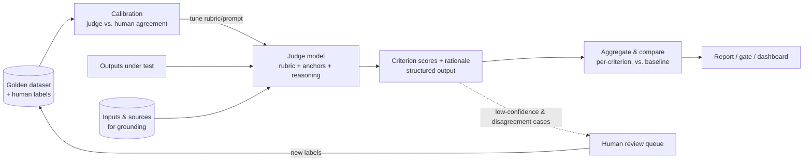

# LLM-as-Judge

> Use a language model, anchored to an explicit rubric and calibrated against human
> labels, to grade AI outputs at a scale and cost no human review process can match —
> while treating the judge itself as a model with biases you must measure.

**Category:** Evaluation
**Also known as:** Model-graded evaluation, AI feedback, Autorater
**Maturity:** Established

---

## Decision

**Use LLM-as-Judge if:**

- ✅ the quality you care about is a judgment call (helpfulness, tone, faithfulness to sources) that string matching can't score
- ✅ you need to grade far more outputs than humans can review — regression suites, A/B runs, production sampling
- ✅ you can afford a one-time investment in a rubric and a small human-labeled calibration set

**Avoid (or defer) LLM-as-Judge if:**

- ❌ a deterministic check answers the question — exact match, schema validation, tests that compile/run, regex on a required disclaimer
- ❌ you have no human labels at all — an uncalibrated judge is an opinion generator, not an evaluator
- ❌ the judged domain needs expertise the judge model demonstrably lacks (specialist medicine, novel math)

## MAP Score

| Dimension | Score | |
|---|---|---|
| Complexity | ★★★☆☆ | 3/5 |
| Latency | ★★★★☆ | 4/5 |
| Cost | ★★★☆☆ | 3/5 |
| Accuracy Impact | ★★★★☆ | 4/5 |
| Production Readiness | ★★★★☆ | 4/5 |

<sub>Higher is better, except **Complexity** (lower is simpler). See [MAP Score](../../../docs/specs/map-score.md). Latency reflects that judging usually runs offline, out of the user's path.</sub>

## Problem

LLM outputs are free-form text; most of what makes them good or bad — grounded in the
sources, appropriately hedged, on-tone, actually answering the question — has no exact
string to assert on. Human review measures it but doesn't scale: a few hundred outputs
per day per reviewer, with drift between reviewers and weeks of lag. So teams ship on
vibes: they eyeball ten examples after each prompt change and hope the other thousand
cases moved the same direction. Every prompt tweak, model upgrade, or retrieval change
is a regression risk nobody can quantify.

## Motivation

A support chatbot's team upgrades the underlying model. On the ten examples everyone
checks, the new model reads better. Two weeks later, escalations are up: the new model
hedges less — and hallucinates policy details more. Nothing caught it, because nothing
*measured* faithfulness.

With a judge in place, the upgrade runs against a 500-case [golden dataset](../) before
rollout. Each answer is graded on a three-criterion rubric — faithfulness to retrieved
policy, completeness, tone — each criterion a 1–4 score with written anchors, produced
by a judge model that was calibrated against ~150 human-labeled cases (agreement within
one point 92% of the time). The report says: completeness +6%, tone flat,
**faithfulness −11%**. The upgrade waits until the regression is understood. The judge
didn't replace human judgment — it *amplified* 150 human labels across every future run.

## When to use

- **Regression gates** — grade the golden set on every prompt/model/retrieval change;
  block the ship on criterion-level drops ([Regression Testing](../)).
- **Comparing variants** — pairwise A/B judging of two prompts, models, or pipelines on
  the same inputs ([Pairwise Comparison](../)).
- **Production sampling** — grade a sample of live traffic to watch quality drift
  between releases ([Eval Dashboards](../../observability/)).
- **Filtering & mining** — triage thousands of outputs to find the worst cases for
  human review; grade synthetic training/eval data before using it.

## When NOT to use

- **A deterministic check exists.** Schema validation, exact match, unit tests, contains
  /doesn't-contain — cheaper, faster, and actually reliable. Judges are for judgment.
- **No calibration data.** With zero human labels you cannot distinguish a strict judge
  from a broken one. Label a starter set first (even 50–100 cases moves you from
  opinion to measurement).
- **The judge grades its own homework unchecked.** Same-model self-evaluation as the
  *only* quality signal compounds self-preference bias into a feedback loop.
- **High-stakes single decisions.** A judge score is a statistical instrument for
  aggregates, not a verdict on one output that matters (legal, medical, safety) —
  that's a human's call, possibly judge-assisted.

## Architecture Diagram



## Flow

1. **Write the rubric first.** Decompose "good" into 3–6 named criteria (e.g.
   faithfulness, completeness, tone), each scored on a small scale (1–4 or binary)
   with a **written anchor per level** — what a 2 looks like, what a 4 looks like.
   Unanchored 1–10 scales produce noise centered on 7.
2. **Build the judge prompt.** One criterion set per judge call; give the judge the
   input, the sources (for grounded criteria), the output under test, the rubric with
   anchors, and 2–3 worked examples. Require structured output: per-criterion score
   *plus a quoted-evidence rationale*, rationale before score.
3. **Calibrate against humans.** Run the judge on a human-labeled set; measure
   agreement (exact and within-one). Iterate on rubric wording and examples until
   agreement is acceptable (within-one ≥ ~90% is a common bar). Record the number —
   it is the judge's error bar forever.
4. **Control the biases.** Pairwise: judge both orderings, count order-flips as ties
   (position bias). Pointwise: pin the judge model+prompt version per experiment
   (drift); prefer a *different* model family from the one being judged, or at least
   measure self-preference; watch verbosity correlation (length-normalize or penalize
   in the rubric).
5. **Run and aggregate.** Grade the eval set; report **per-criterion** aggregates with
   confidence intervals, never a single blended number. Compare against the baseline
   run, not against an absolute bar alone.
6. **Route disagreement to humans.** Low-confidence scores, judge-vs-judge splits (if
   using a panel), and rubric-edge cases go to human review; new labels feed the
   calibration set. The judge gets better at exactly the rate you keep labeling.

## Trade-offs

The central tension is **scale vs. trust**: a judge grades everything cheaply, but every
score inherits the judge's biases — so the pattern's real cost is the calibration and
monitoring machinery that makes the scores believable.

| Dimension | Human review | Deterministic checks | LLM-as-Judge |
|-----------|--------------|----------------------|--------------|
| Judgment-call criteria | Best | None | Good, if calibrated |
| Throughput | ~10²/day | Unlimited | ~10⁴–10⁶/day |
| Cost per 1k outputs | Very high | ~zero | Low (one small-model call each) |
| Consistency | Drifts between reviewers | Perfect | High within a pinned judge version |
| Failure mode | Slow, expensive | Misses everything subjective | Confidently wrong in systematic ways |

### Advantages

- Turns subjective quality into a **trend line** — regressions become numbers before
  they become incidents.
- Amplifies a small human-labeled set across unlimited future evaluations.
- Criterion-level scores localize failures ("faithfulness dropped, tone held") in a way
  a single pass/fail cannot.
- Rationales with quoted evidence make individual scores auditable.

### Disadvantages

- Systematic biases — position, verbosity, self-preference, sycophancy toward
  confident tone — that must be measured, not assumed away.
- A judge is a model dependency: provider updates silently change your measuring stick
  unless versions are pinned and re-calibrated.
- Rubric quality bounds everything; a vague rubric scales vagueness.
- Calibration and disagreement-routing are ongoing costs, not setup costs.

## Failure Modes & Anti-patterns

- ❌ **Unanchored scales** — "rate 1–10" without per-level anchors yields
  distribution-collapsed noise (everything is a 7).
- ❌ **One blended score** — averaging faithfulness with tone hides the regression the
  eval exists to catch. Aggregate per criterion.
- ❌ **Score before rationale** — asking for the number first invites post-hoc
  rationalization; require evidence-quoting reasoning, then the score.
- ❌ **Uncalibrated authority** — shipping gates on a judge whose human-agreement rate
  was never measured.
- ❌ **Judge drift** — floating "latest" as the judge model; every provider update
  re-scores your history into incomparability.
- ❌ **Grading the ungrounded** — judging "faithfulness" without giving the judge the
  sources; it will grade *plausibility* instead.
- ❌ **Judging what you could assert** — burning judge calls on JSON validity or
  required-phrase checks.

## Reference Implementation

Minimal, dependency-free skeleton: an anchored rubric, a judge prompt that demands
rationale-then-score structured output, and calibration math against human labels.
`call_model` is your LLM client.

```python
import json
from dataclasses import dataclass

@dataclass
class Criterion:
    name: str
    anchors: dict[int, str]        # score level -> what that level looks like

RUBRIC = [
    Criterion("faithfulness", {
        1: "Contradicts or invents facts not in the sources.",
        2: "Mostly sourced, but at least one unsupported claim.",
        3: "Every claim supported; minor imprecision in wording.",
        4: "Every claim supported and precisely stated.",
    }),
    Criterion("completeness", {
        1: "Ignores the question.", 2: "Answers part of it.",
        3: "Answers it; misses a secondary aspect.", 4: "Fully answers it.",
    }),
]

def judge_prompt(question: str, sources: str, answer: str) -> str:
    rubric_text = "\n".join(
        f"- {c.name}: " + " ".join(f"[{s}] {a}" for s, a in sorted(c.anchors.items()))
        for c in RUBRIC
    )
    return (
        "You are grading an AI answer against a rubric. For each criterion, first "
        "write a rationale quoting evidence from the answer/sources, then the score.\n"
        f"Rubric:\n{rubric_text}\n\nQuestion:\n{question}\n\nSources:\n{sources}\n\n"
        f"Answer under test:\n{answer}\n\n"
        'Reply as JSON: {"criteria": [{"name", "rationale", "score"}]}'
    )

def grade(call_model, question: str, sources: str, answer: str) -> dict[str, int]:
    reply = json.loads(call_model(judge_prompt(question, sources, answer)))
    return {c["name"]: int(c["score"]) for c in reply["criteria"]}

def agreement(judge: list[int], human: list[int], tolerance: int = 1) -> float:
    """Calibration: fraction of cases where judge is within `tolerance` of the human label."""
    assert len(judge) == len(human) and judge, "need paired labels"
    return sum(abs(j - h) <= tolerance for j, h in zip(judge, human)) / len(judge)
```

## Production Variants

- **Pairwise judging** — "which of A/B is better, or tie", run in both orders;
  more reliable than absolute scores for comparing variants
  ([Pairwise Comparison](../)).
- **Judge panels / juries** — several small, diverse judge models vote; cheaper and
  less self-preferential than one frontier judge, with disagreement as a built-in
  confidence signal.
- **Fine-tuned autoraters** — a small model fine-tuned on your accumulated human
  labels; cheaper per call and more consistent than prompting, at the price of a
  training pipeline.
- **Guardrail judges** — a fast judge inline on live traffic for a narrow criterion
  (policy compliance) before delivery; latency-bound, so scope it tightly
  ([Output Guardrails / Filtering](../../security/)).
- **Grounded-criteria specialization** — dedicated faithfulness judging against
  retrieved sources ([Faithfulness / Groundedness Evaluation](../)).

## Related Patterns

- [Golden Dataset](../) — the labeled set judges are calibrated on and run against.
- [Rubric Scoring](../) — the anchored-criteria technique, as its own pattern.
- [Pairwise Comparison](../) — the comparative variant of judging.
- [Regression Testing](../) — the CI harness judge scores gate.
- [Faithfulness / Groundedness Evaluation](../) — grounded judging specialized to sources.
- [Eval Dashboards](../../observability/) — where per-criterion trends live.

## References

1. Zheng et al., *Judging LLM-as-a-Judge with MT-Bench and Chatbot Arena* —
   <https://arxiv.org/abs/2306.05685>
2. Verga et al., *Replacing Judges with Juries: Evaluating LLM Generations with a Panel
   of Diverse Models* — <https://arxiv.org/abs/2404.18796>
3. Panickssery et al., *LLM Evaluators Recognize and Favor Their Own Generations* —
   <https://arxiv.org/abs/2404.13076>
4. Anthropic, *Statistical approach to model evals* —
   <https://www.anthropic.com/research/statistical-approach-to-model-evals>
5. OpenAI Evals — model-graded evaluation templates —
   <https://github.com/openai/evals>
