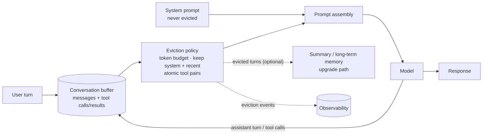

# Conversation (Buffer) Memory

> Keep the running conversation — messages, tool calls, tool results — in a buffer that
> is replayed into every model call, bounded by an explicit token budget with a defined
> eviction rule, so the model remembers the dialogue without the context growing until
> it breaks.

**Category:** Memory
**Also known as:** Message history, Chat buffer, Full-history memory
**Maturity:** Established

---

## Decision

**Use Conversation Memory if:**

- ✅ the product is multi-turn — anything where "it", "that one", or "as I said" must resolve
- ✅ sessions are bounded (minutes to hours), so a budgeted buffer genuinely covers them
- ✅ you want the simplest memory that works before investing in summaries or stores

**Avoid (or defer) Conversation Memory if:**

- ❌ requests are single-shot — a buffer of one is just the request
- ❌ you need recall *across* sessions or very long sessions — that's [long-term](../) / [vector-backed](../) memory territory, layered on top
- ❌ you're using it to smuggle documents into context — bulk content belongs in retrieval, not the message history

## MAP Score

| Dimension | Score | |
|---|---|---|
| Complexity | ★★☆☆☆ | 2/5 |
| Latency | ★★★★★ | 5/5 |
| Cost | ★★★☆☆ | 3/5 |
| Accuracy Impact | ★★★★☆ | 4/5 |
| Production Readiness | ★★★★★ | 5/5 |

<sub>Higher is better, except **Complexity** (lower is simpler). See [MAP Score](../../../docs/specs/map-score.md). Cost reflects that replayed history is re-billed every turn.</sub>

## Problem

Models are stateless: every API call starts from zero, and whatever the user said three
turns ago exists only if your code sends it again. So every chat product replays
history — and naive replay has a built-in failure schedule. Cost grows quadratically
with conversation length (turn *n* re-sends turns 1…n−1). Latency grows with it. Then
the context limit truncates something arbitrary — usually the system prompt or the
oldest turn containing the one fact that mattered — and the model "forgets"
mid-conversation, or worse, keeps obeying a truncated instruction set. Teams discover
this in production, on their longest, most engaged users first.

## Motivation

A coding assistant works through a bug with a user. Turn 2 contains the stack trace;
turn 5, the user's constraint ("we can't upgrade the ORM — locked by the platform
team"); turn 14 asks: *"OK, apply the fix we discussed."* With no memory, turn 14 is
gibberish. With naive full replay, the session works — until week two, when a power
user's day-long session hits the context limit and the assistant suggests upgrading
the ORM, because the silent truncation ate turn 5 and kept the small talk.

The pattern is the disciplined version: the buffer is an explicit component with a
token budget and an eviction rule that protects what matters — the system prompt is
never evicted, the most recent turns are never evicted, tool-call/result pairs are
dropped or kept *atomically*, and eviction is observable (logged, testable) instead of
being whatever the truncation cut. When budgeted eviction starts costing real
information, that is the signal to layer on [summary](../) or [long-term](../) memory —
with data about what was being lost.

## When to use

- **Any conversational product** — chatbots, copilots, support agents; this is the
  baseline memory everything else builds on.
- **Agentic tool loops** — the "conversation" includes tool calls and results; the
  loop depends on the model seeing its own recent actions.
- **As the recency layer** in a composed memory system: buffer for the last turns,
  [summary](../) for the middle, [vector-backed](../) recall for the distant past.

## When NOT to use

- **Single-shot workloads.** Extraction, classification, one-off generation — there is
  no dialogue state to keep.
- **As the only memory for long-lived relationships.** A buffer cannot span sessions;
  promises like "remember my preferences" need a [long-term store](../) written
  explicitly, not a longer buffer.
- **As a document channel.** Pasting files into the history bloats every subsequent
  call; retrieve per-turn instead and keep the buffer for dialogue
  ([Chunking](../../retrieval/chunking/), retrieval patterns).
- **Compliance-sensitive verbatim retention.** Replaying raw history everywhere may
  violate data-retention rules; redact or summarize instead
  ([PII Redaction](../../security/)).

## Architecture Diagram



## Flow

1. **Define the buffer as a component**, not a list you `append()` to in a handler: it
   owns the message sequence (user, assistant, tool calls, tool results) per session,
   persisted if sessions survive process restarts.
2. **Set the token budget explicitly** — a slice of the model's window reserved for
   history, leaving declared room for the system prompt, retrieved context, and the
   response ([Context Window Budgeting](../../context/)). Measure with the tokenizer,
   not `len(text) / 4`.
3. **Append everything as it happens.** Assistant tool calls and their results are
   part of the dialogue; an agent that can't see its last action repeats it.
4. **Evict by rule, not by overflow.** When over budget, drop oldest-first — but never
   the system prompt, never the last *k* turns, and never half of a tool-call/result
   pair (orphaned tool messages are malformed input on most APIs).
5. **Surface eviction.** Log when eviction happens and what was dropped; optionally
   hand evicted turns to a summarizer instead of the void — that is the seam where
   this pattern composes with [Summary Memory](../).
6. **Reset on session boundaries.** New session, new buffer; cross-session continuity
   is a different pattern's job, done deliberately.

## Trade-offs

The central tension is **fidelity vs. footprint**: verbatim history is the highest-
fidelity memory and the most expensive one, re-billed on every turn.

| Dimension | Full buffer (naive) | Budgeted buffer (this pattern) | Summary memory |
|-----------|--------------------|-------------------------------|----------------|
| Fidelity | Perfect until it breaks | Perfect within budget, recency-biased | Lossy, model-mediated |
| Cost per turn | Grows ~quadratically | Capped | Capped + summarizer calls |
| Latency added | Grows with history | Capped | Summarization in the loop |
| Failure mode | Silent truncation cliff | Predictable, observable eviction | Summary drops the wrong fact |
| Engineering | Trivial (and wrong) | Small | Moderate |

### Advantages

- Simplest memory that actually works; no extra model calls, no infrastructure.
- Verbatim: exact wording, code, numbers, and tool output survive — nothing is
  paraphrased away.
- Deterministic and debuggable: the prompt is reconstructable from the buffer state.
- The natural substrate for [prompt caching](../../performance/): a stable, append-only
  prefix is exactly what caches reward.

### Disadvantages

- Recency-only: within budget the model sees everything, past it, nothing — no notion
  of *importance*.
- Replayed tokens are re-billed every turn; long sessions pay the history tax
  repeatedly.
- Long buffers degrade attention before they overflow —
  models weight the middle of long contexts poorly (lost-in-the-middle).
- Per-session by design; users perceive "amnesia" at session boundaries unless a
  longer-term layer exists.

## Failure Modes & Anti-patterns

- ❌ **No budget until the API errors** — the context-limit exception (or silent
  provider-side truncation) becomes your eviction policy.
- ❌ **Evicting the system prompt** — oldest-first without exemptions eventually drops
  the instructions; the model keeps talking, unconstrained.
- ❌ **Splitting tool pairs** — dropping a tool call but keeping its result (or vice
  versa) produces malformed conversations and confused models.
- ❌ **Character-count "tokens"** — `len(text)/4` drifts badly on code and non-English
  text; use the tokenizer.
- ❌ **Buffer as document store** — one pasted PDF turns every following turn into a
  full-document bill.
- ❌ **Unbounded persistence** — buffers that never expire accumulate PII and cost;
  sessions need TTLs and deletion paths.
- ❌ **Rebuilding the prefix every turn** — reordering or rewriting history invalidates
  prompt caches and nondeterministically changes model behavior; append-only within a
  session.

## Reference Implementation

Minimal, dependency-free skeleton: an append-only buffer with a token budget and an
eviction rule that protects the system prompt, the last `keep_recent` turns, and
tool-call/result atomicity. `count_tokens` is your tokenizer. A fuller runnable version
with invariant tests is in
[`reference/python/memory/conversation-memory/`](../../../reference/python/memory/conversation-memory/).

```python
from dataclasses import dataclass, field

@dataclass
class Message:
    role: str                      # system | user | assistant | tool
    content: str
    tool_pair_id: str | None = None  # links a tool call to its result

@dataclass
class ConversationBuffer:
    system: Message
    budget_tokens: int
    keep_recent: int = 4           # never evict the last k non-system messages
    messages: list[Message] = field(default_factory=list)

    def append(self, message: Message) -> None:
        self.messages.append(message)

    def render(self, count_tokens) -> list[Message]:
        """History for the next call: evict oldest-first, atomically, within budget."""
        kept = list(self.messages)
        evicted: list[Message] = []

        def total() -> int:
            return count_tokens(self.system) + sum(count_tokens(m) for m in kept)

        while total() > self.budget_tokens and len(kept) > self.keep_recent:
            victim = kept.pop(0)
            evicted.append(victim)
            if victim.tool_pair_id is not None:  # never orphan a tool call/result
                partner = [m for m in kept if m.tool_pair_id == victim.tool_pair_id]
                for m in partner:
                    kept.remove(m)
                    evicted.append(m)

        if evicted:                 # observable eviction; also the summary-memory seam
            print(f"evicted {len(evicted)} message(s), {len(kept)} kept")
        return [self.system, *kept]
```

## Production Variants

- **Sliding window** — fix the buffer to the last *n* turns instead of a token budget;
  simpler, less adaptive ([Sliding-Window Memory](../)).
- **Buffer + rolling summary** — evicted turns feed a maintained summary that stays in
  context; recency verbatim, history compressed ([Summary Memory](../),
  [Context Summarization](../../context/)).
- **Layered memory** — buffer for now, summaries for the session, a long-term store
  with explicit writes for cross-session facts ([Long-Term Memory](../),
  [Vector-Backed Memory](../)).
- **Cache-aligned buffering** — keep the rendered prefix byte-stable across turns so
  [prompt caching](../../performance/) prices most of the history at cache rates.
- **Provider-managed threads** — hosted conversation state (e.g. server-side threads /
  sessions) trades control over eviction for zero bookkeeping; the budget discipline
  still applies, just remotely.

## Related Patterns

- [Sliding-Window Memory](../) — the fixed-turn-count simplification.
- [Summary Memory](../) — where evicted turns should go next.
- [Long-Term Memory](../) / [Vector-Backed Memory](../) — cross-session recall layered on top.
- [Context Window Budgeting](../../context/) — the whole-prompt budget this buffer's slice comes from.
- [Message Pruning](../../context/) — finer-grained in-context reduction.
- [Prompt Cache](../../performance/) — why append-only, stable prefixes pay.

## References

1. Anthropic, *Prompt caching* (stable prefixes and conversation replay) —
   <https://docs.anthropic.com/en/docs/build-with-claude/prompt-caching>
2. Liu et al., *Lost in the Middle: How Language Models Use Long Contexts* —
   <https://arxiv.org/abs/2307.03172>
3. Packer et al., *MemGPT: Towards LLMs as Operating Systems* (tiered memory beyond
   the buffer) — <https://arxiv.org/abs/2310.08560>
4. OpenAI, *Conversation state* (managing message history across turns) —
   <https://platform.openai.com/docs/guides/conversation-state>
